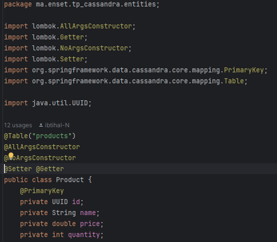
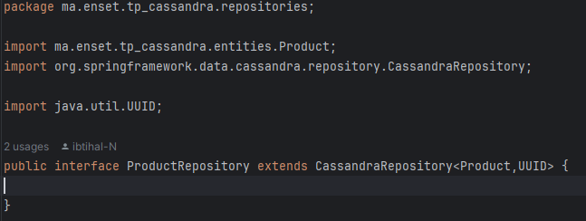
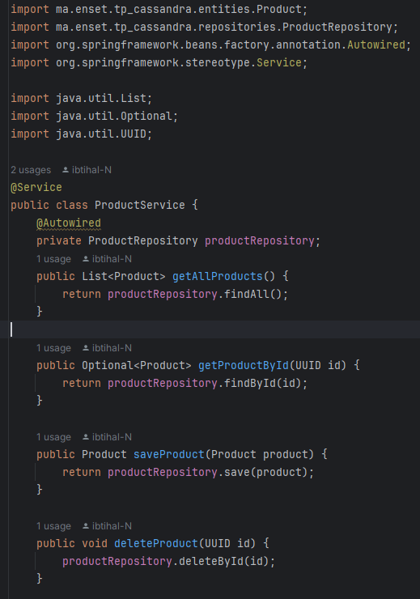
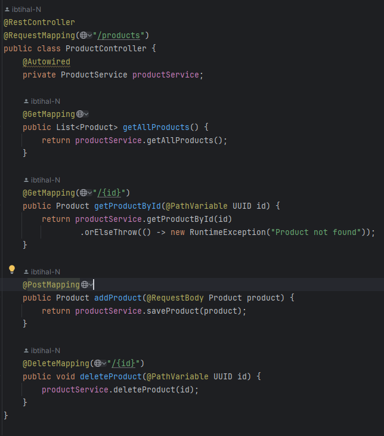

<h1>Compte rendu: Cassandra et Spring Boot</h1>
<h3>Introduction :</h3>

Dans le cadre de ce travail pratique, j'ai mis en place une application Spring Boot pour gérer un keystore nommé ecommerce. L'objectif principal était de manipuler une base de données Cassandra en utilisant les fonctionnalités de Spring Boot. Pour ce faire, j'ai créé une entité Product pour représenter les produits du magasin, mis en place un repository ProductRepository pour accéder à la base de données, développé une couche de service ProductService pour gérer les opérations CRUD, et exposé ces fonctionnalités via un contrôleur Rest ProductController. Ce compte rendu détaille chaque aspect de mon implémentation, ainsi que les tests effectués et les résultats obtenus.

<h3>1. Structure du projet :</h3>

La structure de mon projet Spring Boot est organisée de manière à séparer clairement les différentes couches de l'application. Voici un aperçu de la structure du projet :

<h3>2. Entité Product :</h3>

   L'entité Product représente les produits disponibles dans le keystore ecommerce. Elle comprend les attributs suivants :

id : UUID 
name : String 
price : double 
quantiteStock : int 
J'ai annoté cette classe avec @Table("products") pour spécifier le nom de la table dans la base de données Cassandra, et j'ai utilisé @PrimaryKey sur l'attribut id pour définir la clé primaire.

<h3>3. Repository ProductRepository :</h3>

Le repository ProductRepository utilise Spring Data Cassandra pour fournir des méthodes pour accéder à la base de données Cassandra. Il étend l'interface CassandraRepository et utilise l'entité Product ainsi que le type UUID de l'identifiant.

<h3>4. Service ProductService :</h3>

La couche de service ProductService contient les méthodes pour gérer les opérations CRUD de base sur les produits, ainsi que la possibilité de chercher des produits par mot clé.

<h3>5. Contrôleur Rest ProductController :</h3>

Le contrôleur Rest ProductController expose les différentes fonctionnalités de l'application via des points de terminaison REST. Il utilise les méthodes du service ProductService pour traiter les requêtes.

<h3>Conclusion :</h3>

En conclusion, ce projet m'a permis de comprendre comment intégrer Cassandra avec Spring Boot pour la gestion d'une base de données. J'ai appris à créer des entités, des repositories, des services et des contrôleurs dans une application Spring Boot, et à exposer les fonctionnalités via une API REST. Les tests effectués avec Postman ont confirmé le bon fonctionnement de l'application. Ce TP a été une expérience enrichissante pour approfondir mes connaissances en développement Spring Boot et en intégration de bases de données NoSQL.

